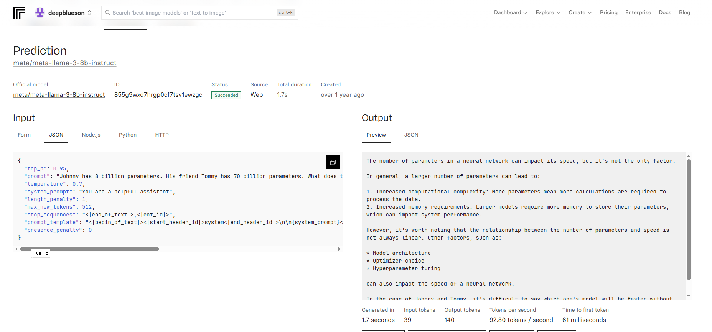
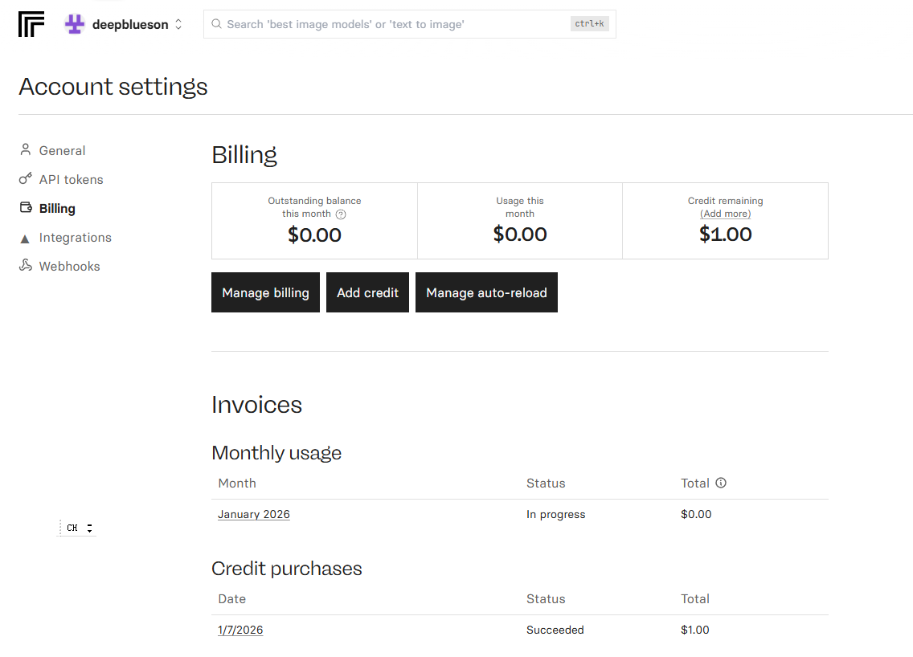
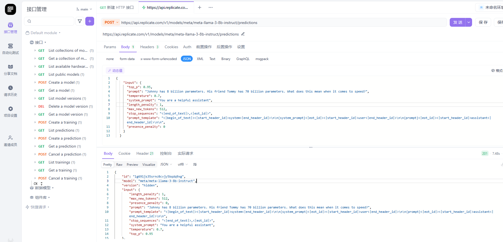
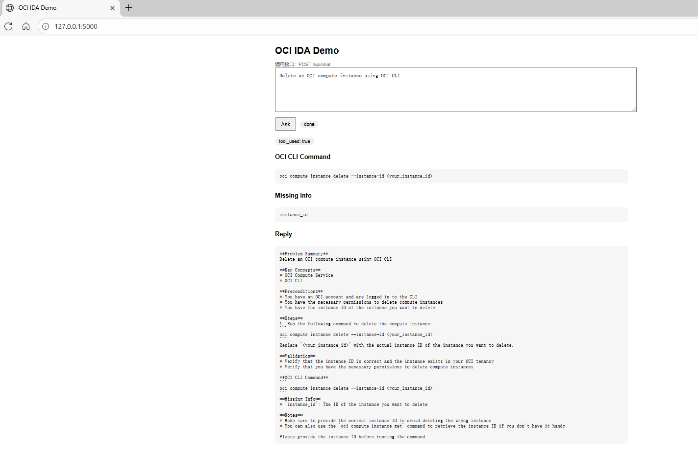

# OCI Intelligent Documentation Assistant

OCI IDA 是一个基于Flask + LangGraph + LLaMA3的助手，用于将自然语言问题转换为结构化的OCI 技术说明，并在合适场景下自动生成OCI CLI Command。

该项目具备以下能力：

- 自然语言理解

- OCI 场景下的CLI命令生成

- 缺失参数的提示

- 结构化、可读性良好的输出

## 1. 系统概述

OCI IDA采用 多阶段LLM调用 + LangGraph的方式，将一次用户请求拆解为三个阶段：

+ Router：判断问题是否涉及资源操作，是否需要生成OCI CLI command。

+ Command Generator（自动选择）：判定需要CLI时，生成对应的OCI CLI command，并指出缺失的最小必要参数。

+ Answer Generator：基于问题本身 + 工具输出，生成结构化、规范的最终回答。

## 2. 技术架构

```
User Input
↓
Router (LLM)
↓
是否需要 CLI Command？
↓
Command Generator (LLM，自动选择)
↓
Answer Generator (LLM)
↓
Structured Response
```

运行需求


- Python 3

- Flask

- LangGraph

- Meta LLaMA 3 8B Instruct（通过 Replicate API 调用）

- 原生HTML + JavaScript（大模型生成的）

## 3. 功能特性

- 支持OCI概念类问题（如 What is OCI Object Storage）。
- 支持OCI资源操作类问题（list / create / delete / update）。
- 自动判断是否需要生成OCI CLI Command。
- 使用占位符输出CLI参数，避免任何敏感信息泄露。
- 明确提示当前缺失的必要参数（Missing Info）。
- 提供统一的JSON API与简易网页端界面。

## 4. 环境依赖

- Python > 3.8

- 一个可用的Replicate账号（需要注册后绑定银行卡）

  

  + 充值页面：[Account settings | Replicate](https://replicate.com/account/billing)

    

- Replicate API Token

  + 测试攻略：[Replicate API调用教程，图文讲解Replicate接口的用法](https://apifox.com/apiskills/how-to-debug-replicate-api/)

  + 测试页面：[Replicate API copy](https://app.apifox.com/project/7670865)

    

## 5. 安装与配置

### 5.1 获取代码

将项目代码放置于本地目录，例如：

```
OCI_IDA/
├── app.py
├── requirements.txt
├── README.md
└── .env
```

### 5.2 创建虚拟环境

```bash
conda create -n oci_ida
conda activate oci_ida
```

### 5.3 安装依赖

```bash
pip install -r requirements.txt
```

### 5.4 配置环境变量

在项目根目录创建 `.env` 文件，内容如下：

```env
REPLICATE_API_TOKEN=your_replicate_api_token_here
SSL_CERT_FILE=/etc/ssl/certs/ca-certificates.crt
INSECURE_SSL=1
```

请将`your_replicate_api_token_here`替换为你自己的Replicate API Token，不需要加引号。同时找到ca-certificates.crt位置，否则会被SSL协议卡掉（这里尝试了很久）。

## 6. 启动项目

完成配置后，运行：

```bash
python demo.py
```

服务启动后，默认监听地址为：

```
http://127.0.0.1:5000
```

## 7. 使用方式

### 7.1 网页端访问

在浏览器中打开：

```
http://127.0.0.1:5000/
```

该页面提供一个极简问答界面，用于快速测试和演示系统能力。

### 7.2 API调用方式

#### PowerShell 示例

```powershell
$r = Invoke-RestMethod `
  -Uri http://127.0.0.1:5000/api/chat `
  -Method POST `
  -ContentType "application/json" `
  -Body '{"prompt":"Delete an OCI compute instance using OCI CLI"}'
```

#### 查看返回结果

```powershell
$r.tool_used
$r.generated_command
$r.missing_fields
$r.reply
```

### 7.3 返回示例

```json
{
  "reply": "...",
  "tool_used": true,
  "generated_command": "oci compute instance terminate --instance-id <your_instance_id>",
  "missing_fields": ["instance_id"]
}
```



## 8. 远程部署与端口映射（比如我的开发环境在服务器）

如果服务运行在远程服务器上，可通过SSH端口映射在本地访问：

```bash
ssh -p 5303 -L 5000:127.0.0.1:5000 name@xxx.xx.xxx.xx
```

随后在本地浏览器中访问：

```
http://127.0.0.1:5000/
```

## 9. 说明

- 本项目为示例，不会直接执行任何OCI操作

- 所有OCI CLI Command仅作为参考，需要用户自行确认并执行

- 当前版本未接入OCI官方文档检索

- 模型调用为无状态设计，每次请求相互独立

## 10. 后续待更新

- 接入OCI官方文档的检索增强生成

- 支持多轮对话与上下文记忆

- 增加OCI SDK示例生成

- 增加身份与权限校验机制

- 前端界面进一步设计

## 11. License

This project is intended for research, learning, and demonstration purposes only.